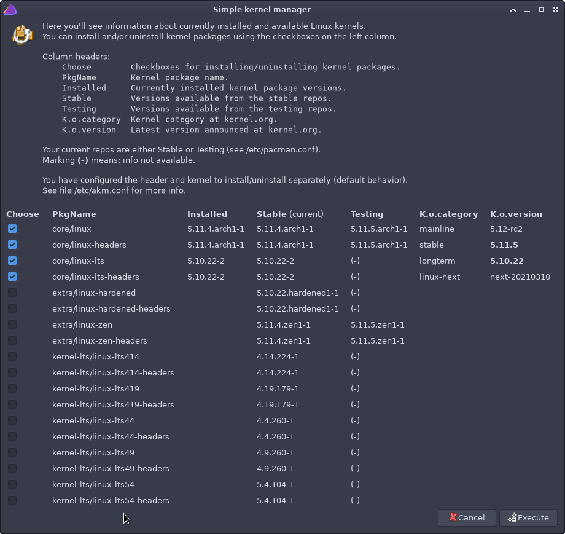

# akm
Simple kernel manager for EndeavourOS and Arch.<br>
Note: does not support kernels in the AUR.


## Usage
```
akm [options]

Options:
    --connect-header      Make kernel and header package go together at install or uninstall.
    --small               Make the akm window smaller, meant for helping with small displays at 1366x768 resolution.
    --help | -h           This help.
```
Option `--scroll` (enables scrolling in the window) is also available, but it is enabled by default.

## Options

Without options, `akm` installs selected packages and uninstalls unselected packages.<br>
<br>
If option `--connect-header` is used, then `akm` ties kernel and header package into one atomic "unit" when installing or uninstalling.<br>
If selections of a kernel and its header conflict, kernel selection is used for both packages.
For example, if you only choose to install package `linux-zen` but not its header, option `--connect-header` would cause installing `linux-zen-headers` too.

Option `--scroll` may be useful when using kernels from additional repositories.

## Configuration file

Configuration file `/etc/akm.conf` manages how `akm` works.<br>
Currently the supported configurations are:

Variable | Description | Supported values
:--- | :--- | :---
KERNEL_HEADER_WITH_KERNEL | Tie header package with the kernel package.<br>Does the same as option `--connect-header`. | "no" (=default) and "yes"
AKM_KERNELS_HEADERS | Additional kernel and header names. | List of `reponame/pkgname` entries.
AKM_WINDOW_WIDTH | Width of the `akm` window in pixels. | A positive number, default is 900.

<br>

## Advanced example: add a new (unofficial) package repository

You can add more (unofficial) package repositories into `/etc/pacman.conf`.<br>
If the repository contains linux kernel packages, `akm` tries to automagically add them to the list.

The picture below shows `akm` window after adding the following unofficial repo:
```
# NOTE: this particular repo is no more supported!

[kernel-lts]
Server = https://repo.m2x.dev/current/$repo/$arch
```

<br>



### Caveat

This method of automatically detecting kernel names is limited because kernels can be named in various ways.<br>
Use configuration variable AKM_KERNELS_HEADERS (mentioned above) to add a list of kernel and header names from an additional repository. This is useful if the automatic kernel name detection does not recognize certain kernel names.

Just as an example, to use the info from the picture above, your `/etc/akm.conf` could look something like this:

```
#!/bin/bash

### Config file for akm.

# When installing/uninstalling a kernel, you may configure to
# install/uninstall the related header too.
# Values: "yes" or "no"
# Default: no
local KERNEL_HEADER_WITH_KERNEL=yes

# List of kernel and header names when using additional repos.
# Example:
#   local AKM_KERNELS_HEADERS=(
#       reponame/linux-xxx  reponame/linux-xxx-headers
#       reponame/linux-yyy  reponame/linux-yyy-headers
#       ...
#   )
# where
#    reponame   The name of an additional repository.
#    linux-xxx  The name of a kernel.
#
local AKM_KERNELS_HEADERS=(
    kernel-lts/linux-lts414  kernel-lts/linux-lts414-headers
    kernel-lts/linux-lts419  kernel-lts/linux-lts419-headers
    kernel-lts/linux-lts44   kernel-lts/linux-lts44-headers
    # and so on...
)

# Width of the akm window in pixels.
# Default: 900
local AKM_WINDOW_WIDTH=1000
```
