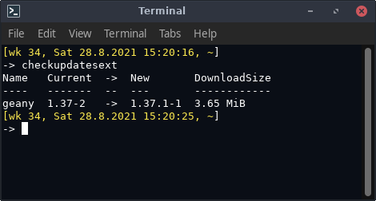

# checkupdatesext

A`checkupdates` wrapper. Instead shows the updates with columnized layout and a header.



## Synopsis

```
checkupdatesext
```
## Returns
The same as `checkupdates`.

## See also

[checkupdates](https://man.archlinux.org/man/checkupdates.8)
