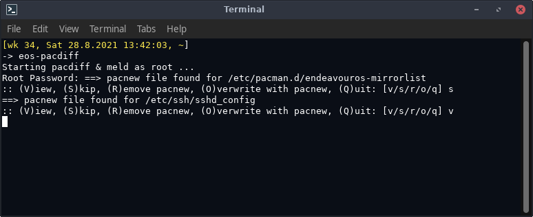
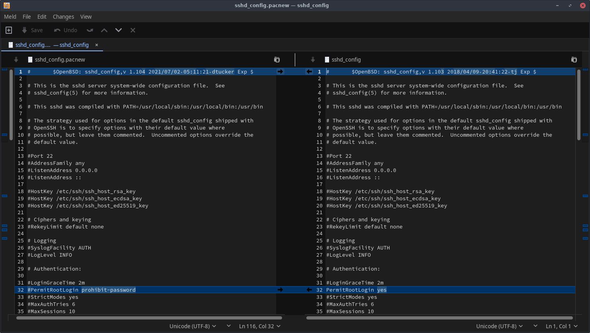

# eos-pacdiff

`eos-pacdiff` combines the `pacdiff` program with a user-selectable file comparison program as a convenient and easy-to-use entity.<br>
User can select the file comparison program with variable `EOS_WELCOME_PACDIFFERS` in file `/etc/eos-script-lib-yad.conf`.<br>
Currently `meld` is the recommended file comparison program.





## Synopsis
```
Usage: eos-pacdiff
```

## See also

[pacdiff](https://man.archlinux.org/man/pacdiff.8)
