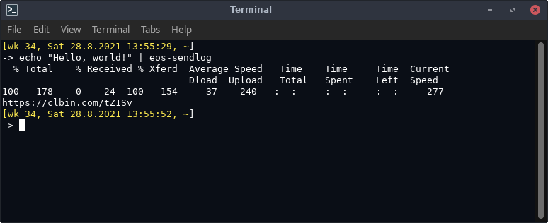

# eos-sendlog

Sends a (text) file from standard input to a pastebin service and shows the service URL where the file is stored.

Note: personal data will *not* be removed by `eos-sendlog`.<br>
If you want personal data removed, consider using `eos-log-tool` for specific logs.




## Supported options

Tip: see `eos-sendlog --help` for up-to-date options.

Option | Description
:--- | :---
--0x0 | Uses pastebin 0x0.st.
--dpaste | Uses pastebin dpaste.com.
--termbin | Uses pastebin termbin.com.
--help, -h | Show this info.
--verbose, -v | Be a bit more verbose.


## Examples


```
cat log.txt | eos-sendlog
lspci -vnn | eos-sendlog
```

### Input from multiple commands

`eos-sendlog` can take input from multiple commands.<br>
For example:

```
eos-sendlog "lsusb ; inxi -Fza"
```

### Select pastebin provider

```
eos-sendlog --dpaste "lsusb ; inxi -Fza"
cat log.txt | eos-sendlog --0x0
```
