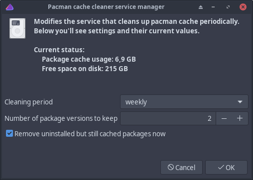

# paccache-service-manager

Tool to manage the paccache systemd service.<br>
Essentially the service prevents package cache size growing too much by setting a limit to how many old package versions are saved to the package cache.



## Synopsis

```
paccache-service-manager
```

## See also
```
paccache(8)
```
