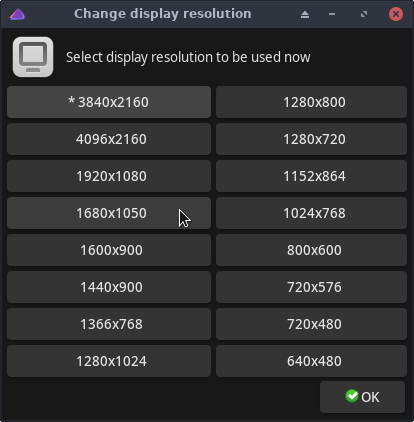

# eos-bash-shared

Code shared between EndeavourOS apps, and certain small but useful tools.

File name | Description
:---- | :-------
ChangeDisplayResolution | Helps changing display resolution (with xrandr).
device-info | A helper app for finding info about devices.
eos-connection-checker | Checks that an internet connection is available.
eos-FindAppIcon | Find a suitable icon path for an app.
eos-script-lib-yad | Common bash code for various EOS apps.
eos-script-lib-yad.conf | Configuration file for eos-script-lib-yad.
eos-wallpaper-set | Sets the wallpaper according to the current DE, given file, or from given folder.
ksetwallpaper.py | KDE wallpaper installer, forked from https://github.com/pashazz/ksetwallpaper.
paccache-service-manager | Tool to manage paccache service (prevents package cache size growing too much).
pkginfo | Show usage and/or developer information about an EndeavourOS/Arch/AUR package. Usage: `pkginfo <package-name>`
pkginfo.completion | Bash completion for pkginfo. Note: does not support completion for AUR packages because of performance.
RunInTerminal | Run one or many commands in a new terminal. Useful for Welcome and related apps.
su-c_wrapper | A small utility to perform command "su -c". Useful e.g. for users without sudoers rights.
UpdateInTerminal | Simple system updater using only terminal.
UpdateInTerminal.desktop | Launcher & icon for UpdateInTerminal.

  

## Pictures of a few apps

 

### ChangeDisplayResolution:

 

### paccache-service-manager:

 

