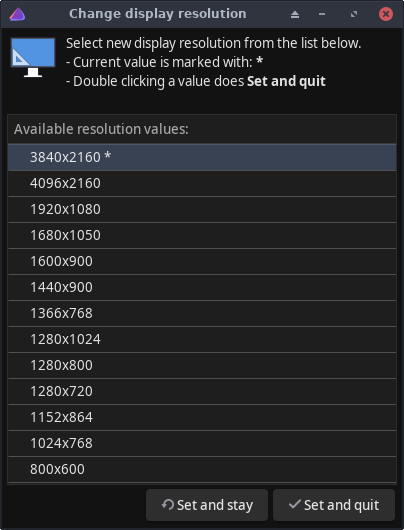

# ChangeDisplayResolution

Helps changing display resolution (with xrandr).

Select the desired resolution on the list and click
- **Set and stay** (sets the reso but doesn't quit)
- **Set and quit** (sets the reso and quits)
- (x) on the upper right corner to just quit

The * character on the list shows the current resolution.
 

