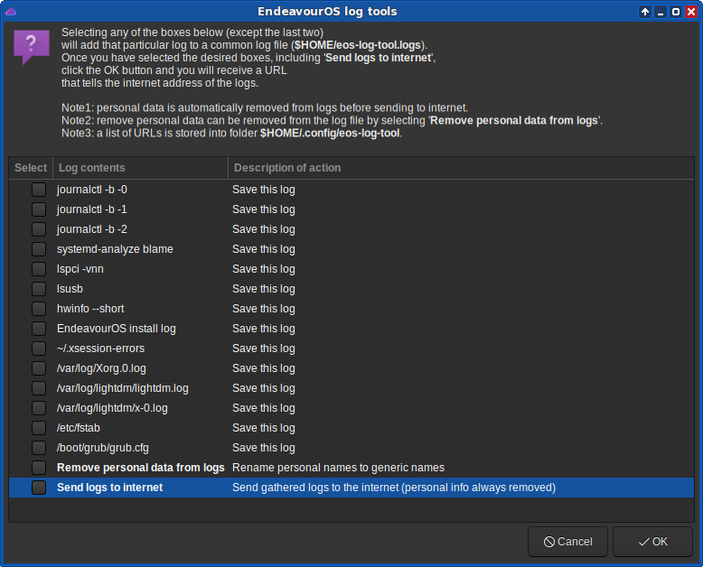

# eos-log-tool
A GUI tool for copying various system logs to the internet.

## Options

Name   |   Description
:--- | :---
`-j` `--enable-journal` | Enable showing journal logs. Note that some logs *may* include personal data. 
`-h` `--help` | This help.

## Use cases

If a user wants help in troubleshooting an issue, with this tool user
can share logs for other users to see e.g. on the EndeavourOS forum. 
Note that without logs and/or other system information troubleshooting can be practically impossible.

This tool aims to hide all personal information from the logs that will be sent to the internet. But hiding is not perfect (especially on journals), so it is a good idea to **Save logs locally** before sending.

Button **Share logs to internet** sends the logs to the internet, and an <u>URL</u> is returned after a successful send. 
This <u>URL</u> is the thing to share with those that help troubleshooting the issue.
