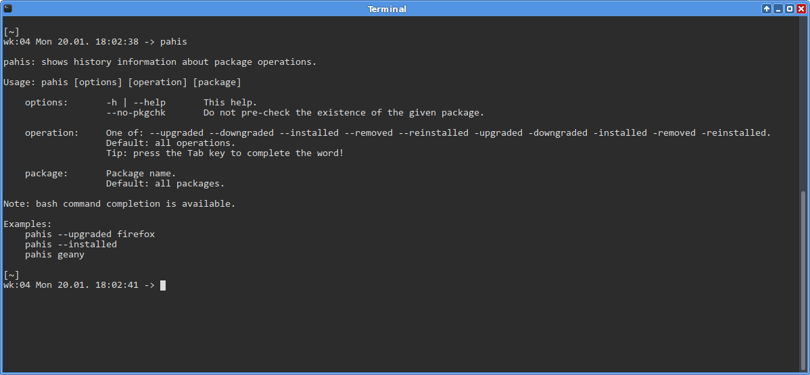
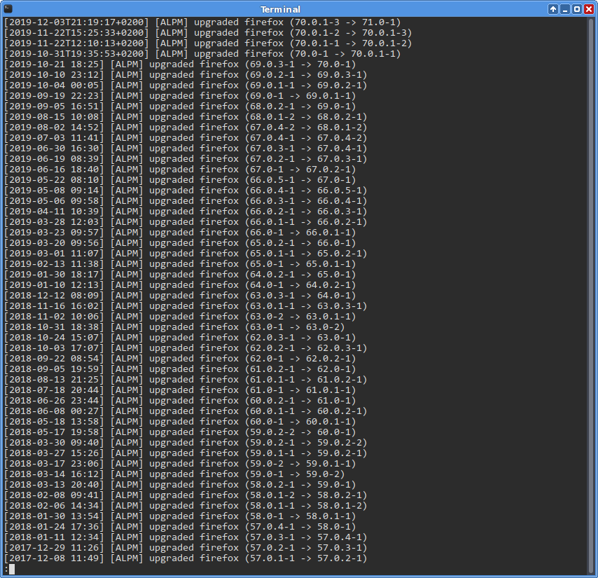

# pahis
Show pacman history for all or selected packages.

## Usage:
Run command
<pre>
pahis
</pre>
about how to use it. 
Note: you can use bash completion (tab) to complete a partial words and options!

Examples:
<pre>
pahis --upgraded           # shows upgrades of all packages
pahis --upgraded firefox   # shows when firefox was upgraded
pahis geany                # shows all operations on geany
pahis --removed            # shows removals of packages
pahis --installed          # shows installs of packages
</pre>

## Screenshots after commands
<pre>
pahis
</pre>

<pre>
pahis --upgraded
</pre>

<pre>
pahis --upgraded firefox
</pre>

