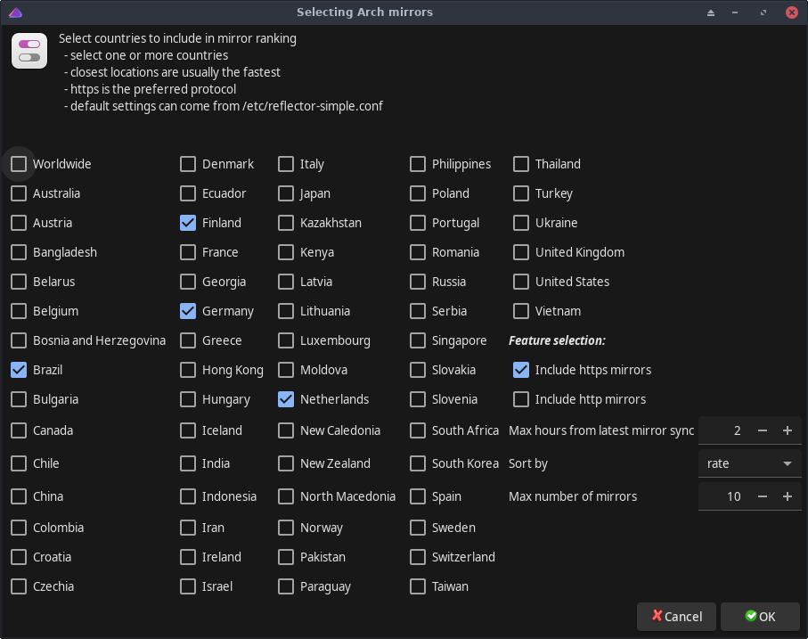

# reflector-simple

Simple GUI for the `reflector` command.<br>
Screenshot:<br>



## Notes about configuration of reflector-simple

- configuration file `/etc/reflector-simple.conf` is supported
- if `/etc/reflector-simple.conf` exists, the GUI uses it by default
- configuration file can contain options supported by the `reflector` command. Use command `reflector -h` for more info

### Additional old compatibility notes
- for backwards compatibility, configuration file `/etc/reflector-auto.conf` is still supported, but will no more be supported after year 2020.
- if file `/etc/reflector-simple.conf` exists, then `/etc/reflector-auto.conf` is not used

## Operational changes

Version 1.15.2-1 changed `reflector-simple` by changing the setting **Max number of mirrors** (which uses reflector's --number option) to **Max number of freshed mirrors** (uses reflector's --latest option).

The old behaviour can be achieved by using an environment variable `REFLECTOR_SIMPLE_PREFER_NUMBER` with value "yes", e.g.
```
REFLECTOR_SIMPLE_PREFER_NUMBER=yes reflector-simple
```

Version 1.16.1-1 changed the method of finding the country code of a user. Now user can change the value of variable `REFLECTOR_SIMPLE_COUNTRY_METHOD` in file `/etc/reflector-simple-tool.conf` and see what's the best (=fastest) method (number from 0 to 5) of fetching the country code. This may have a great effect on how quickly `reflector-simple` shows its first window when started.