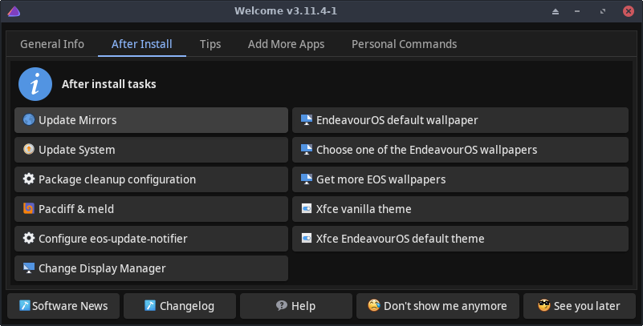

# welcome

Welcome is an application that helps users by providing
- tools for system management and customization
- links for additional information

and more.

Welcome has two main uses:
- helps in the install phase
- helps in the system usage phase

<br>



## Synopsis

eos-welcome [options]

## Options
```
--enable | -f     Enable this Welcome app.
--disable         Disable this Welcome app.
--lang=X          Use language X on the user interface. Default for X: 'en'
--version         Show the version of this app.
--startdelay=X    Wait before actually starting this app.
                  X value syntax is the same as in the 'sleep' command.
--changelog       Show the changelog of this package.

```
### Install time options
```
--pkglist=URL     User can give an URL to a file that contains a list of additional packages
                  to install. Package names are listed as one package name per line.
                  Empty lines and comments (lines starting with character #) are allowed.
                  Wildcards are not supported.
                  Note: currently the URL cannot refer to a local file.
                  Note2: this feature is available only in the 'online' install mode.
```

## Description

### Enabling or disabling Welcome

To have Welcome app started when you log in, make sure
- Welcome app is selected in the Autostart feature of the DE<br>
    or
- `Hidden=false` is set in file `/etc/xdg/autostart/welcome.desktop`

On DEs that do not work well with system's *Autostart* feature, you may also disable the Welcome app from the app itself
- with the `--disable` option
- with a button in the app (some DEs only)

To re-enable the app, click the Welcome app icon, or use the terminal command
```
eos-welcome --enable
```

Note: check also settings in the configuration file `~/.config/EOS-greeter.conf`.

### Personalizing Welcome

User may add own buttons into the Welcome app. The buttons will appear under the **Personal Commands** tab.

### Language support

Option `--lang=X` currently supports a small set of languages.<br>
The X should consist of two (or more) letters (like 'en' for English or 'pt_BR' for Brazilian Portuguese).

See the supported languages (the X) e.g. by terminal command
```
ls -1 /usr/share/endeavouros/scripts/translation-*.bash | \
   sed 's|.*/translation-\([a-zA-Z_]*\)\.bash|\1|'
```
If option `--lang` is not given, the language value is extracted from
the first letters of the environment variable LANG.<br>
If the extracted value is not supported by Welcome, English will be used.

## Tips

### Software news

Welcome app window includes a button **Software News** on the lower left corner.<br>
It contains useful and important news about the EndeavourOS software, e.g. manual interventions or important code changes.

Make sure you click that button regularly!

### Add favorite packages at install phase

To customize the online mode install phase, there are *alternative* ways to add your favorite packages to the EndeavourOS default set of packages:

1. You can directly modify file `$HOME/user_pkglist.txt` and add package names as described with option `--pkglist`.
2. If you have a file in the internet that contains a list of packages, use option `--pkglist` as described above.

## Examples
```
eos-welcome --lang=en         # use English instead of the local language
eos-welcome --enable          # re-enable Welcome after disabling it

# Starting the install from the terminal on the ISO.
# Close the Welcome app first, then commmand:
eos-welcome --pkglist=https://github.com/<path-to-your-pkglist-file> &

# Another way to add packages at install.
# Close the Welcome app first, then commmand:
nano ~/user_pkglist.txt       # add some package names
eos-welcome &
```
## See also

https://discovery.endeavouros.com/endeavouros-tools/welcome
